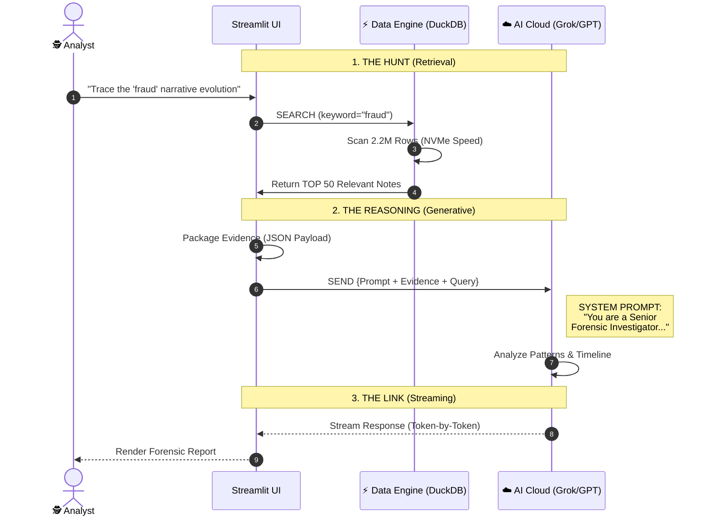

# Architecture: The "Chat with Data" Engine

## Executive Summary
The **Chat with Data** feature is a high-precision **Retrieval Augmented Generation (RAG)** system designed for forensic analysis. Unlike generic chatbots, it provides answers grounded strictly in the underlying Community Notes dataset.

---

## ⚡ The Forensic Pipeline (Sequence Diagram)

---

## ⚙️ Technical Mechanics

### 1. Retrieval Strategy (The "Hunt")
*   **Engine**: DuckDB running on ephemeral NVMe storage (`/tmp`).
*   **Latency**: Sub-10ms search time.
*   **Logic**:
    *   Filters notes by keyword matching (Summary + Tweet ID).
    *   Sorts by `createdAtMillis` (descending) to prioritize recent activity.
    *   Selects the top **50** entries to fit comfortably within the model's context window.

### 2. The Persona (The "Brain")
We do not ask the AI to "chat". We ask it to **investigate**.
*   **System Role**: "Senior Forensic Investigator".
*   **Instruction**: "Analyze the provided JSON mission data. Identify coordination, timeline evolution, and key actors. Be objective and concise."
*   **Constraint**: The model is strictly forbidden from using outside knowledge for the core facts—it must cite the provided notes.

### 3. Stateless Intelligence
To ensure forensic integrity:
*   **The UI is Stateful**: It remembers your conversation history so you can scroll back.
*   **The AI is Stateless**: Every query is treated as a fresh investigation. It sees the *current* query and the *current* evidence. It does not "remember" the previous turn's hallucination. This reduces "drift" and keeps answers grounded in data.
